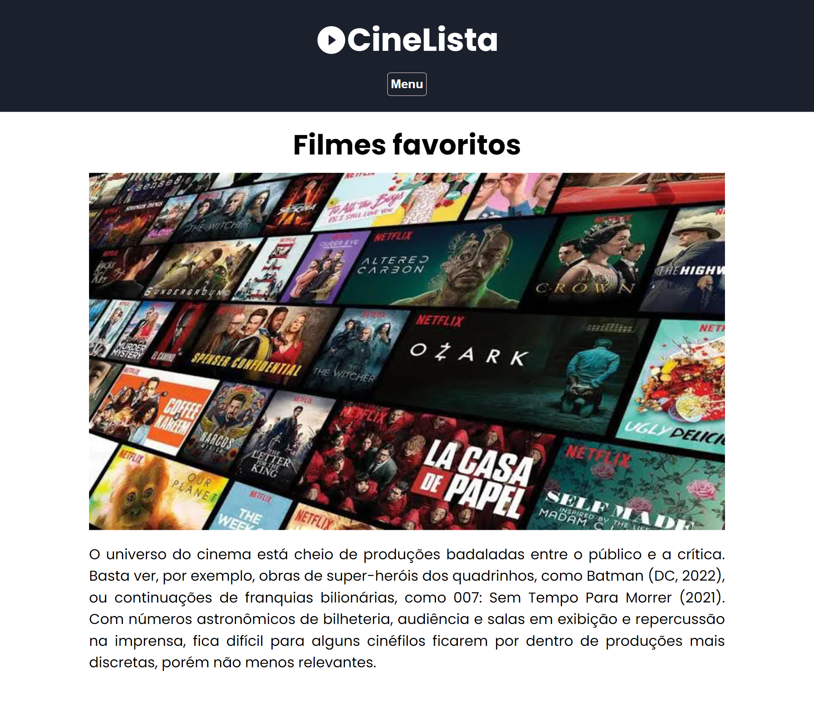

# ▶CineLista

Página web contendo uma lista de filmes, criada usando React
## 📸Screenshots




## 🚀Tecnologias

- NextJS
- ReactJS
- Typescript
- HTML e CSS
- CSS Modules
- Styled Compnents


## ℹ️ Rodando localmente

Clone o projeto

```bash
  git clone https://github.com/GabPSant/Filmes-web.git
```

Entre no diretório do projeto

```bash
  cd Filmes-web
```

Instale as dependências

```bash
  npm install
```

Inicie o servidor

```bash
  npm run dev
```


## 🌐Deploy

https://filmes-web-one.vercel.app/

## ➡️Autores

- [@GabPSant](https://www.github.com/GabPSant)
- [@MariCruz31](https://www.github.com/MariCruz31)
- [@Giselle-Jacinto](https://www.github.com/Giselle-Jacinto)
- [@sthallysson](https://www.github.com/sthallysson)

